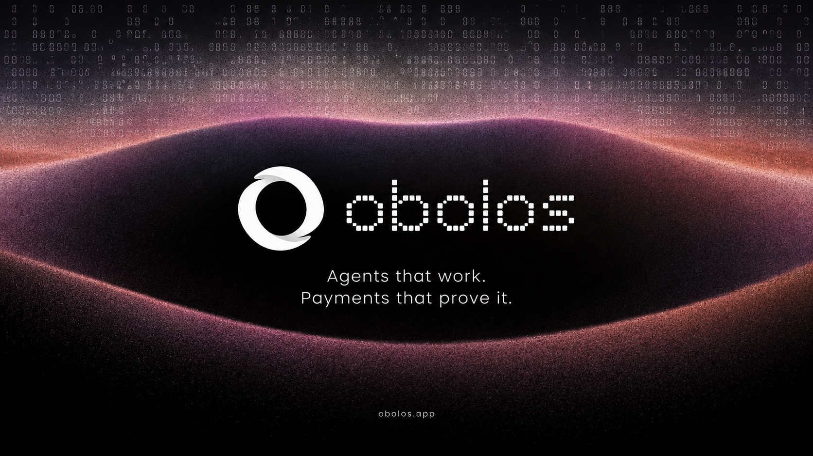
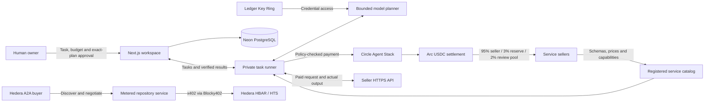

# Obolos

**A marketplace where agents buy digital services within human-approved spending limits.**

[Open app](https://obolos.app/app) · [Browse marketplace](https://obolos.app/marketplace) · [Payment evidence](docs/evidence/2026-09-13-full-end-to-end.md) · [Architecture](docs/economy-architecture.md) · [Demo walkthrough](docs/demo-script.md)

Describe a task, review the proposed providers and exact cost, and approve execution. A private runner buys the selected services, passes real outputs between steps, and returns results with payment receipts. Sellers publish HTTPS APIs with their own capabilities, schemas and prices.

Obolos supports general digital work through its registered services, including writing, translation, coding assistance, data retrieval, text analysis and storage. A task can compose up to five service calls. Available providers determine what it can do; unsupported work is blocked before payment.

Built for ETHOnline 2026 using **Circle Agent Stack and Arc**, **Hedera and Blocky402**, and **Ledger Key Ring**.

> **Live testnet application.** Service execution and payments are real. Only the Ledger device uses the disclosed Speculos emulator. New simulated runs are disabled. Execution requires a configured private runner and funded testnet wallets.

## How it works

1. **Publish or discover.** Sellers register service terms on Arc and publish a discoverable description, endpoint, input/output schemas and examples.
2. **Describe the work.** A buyer selects an agent, enters a task and sets a maximum service budget.
3. **Approve the plan.** The private planner proposes registered providers, input routing and a fixed price. The owner approves that exact plan; planning itself cannot spend.
4. **Execute within limits.** The runner checks current policy and service terms, pays through Circle Agent Stack, and calls each provider with its actual inputs.
5. **Inspect the result.** The app shows outputs, finalized settlement, seller delivery and buyer acknowledgment. Durable order IDs allow interrupted delivery to resume without a second payment.

The workspace brings together [agents and tasks](https://obolos.app/app), [purchases and seller earnings](https://obolos.app/app/marketplace), [economic measurements](https://obolos.app/app/economy), [evidence](https://obolos.app/app/evidence), and [developer integrations](https://obolos.app/app/developers).

## Architecture



The public app hosts accounts, task state, discovery and indexed evidence. The private runner and broker retain wallet sessions, Ring access and payment journals. The model proposes work but receives no wallet tools. Circle signs Arc transactions through its own wallet infrastructure; Ledger protects broker credentials and approves spending mandates. These are separate responsibilities, with no bridge or atomic cross-chain settlement.

General tasks use the Arc catalog. The separate Hedera A2A negotiation workflow currently sells repository data; it does not negotiate arbitrary tasks automatically. See [trust boundaries](docs/architecture.md) and the [service protocol](docs/economy-provider-protocol.md).

## Integrations and stack

| Layer | Implementation |
| --- | --- |
| Application | Next.js 16.3.4, React 19, TypeScript, Lucide icons |
| Persistence and hosting | Neon PostgreSQL, versioned SQL migrations, Vercel |
| Planning and execution | Private Node.js/TypeScript runner, GPT-5 nano, bounded service plans, durable payment journals |
| Arc payments | Circle Agent Stack CLI, test USDC, Solidity settlement and policy contracts, viem |
| Hedera commerce | Hiero SDK, x402, Blocky402 facilitator, metered HBAR and HTS service payments |
| Agent discovery and evidence | Service directory, A2A negotiation, HCS-14 identity anchors, HCS payment audit |
| Scheduled payments | Finite native Hedera Scheduled Transactions with verified deliveries |
| Credential protection | Ledger `wallet-cli ring`, LedgerJS mandate signing, explicit Speculos development mode |
| Verification | Vitest, isolated PostgreSQL integration tests, Playwright, executable Solidity contract tests |

Hedera's implemented bonus paths include per-repository metering, A2A, HCS-14, directory discovery, HTS, HCS audit and a finite two-payment schedule. This is not continuous streaming; publishing an HCS audit for every new payment is not automatic. [Receipts and reproduction guides](docs/evidence/2026-09-13-hedera-bonus.md).

## Run locally

Use **Node.js 22.12+** and npm. Wallet CLI is installed by the repository; native USB dependencies may require platform build tools.

```sh
git clone https://github.com/saiisback/obolos.git
cd obolos
npm ci
cp .env.example .env.local
```

For a fresh checkout, edit `.env.local`: configure a PostgreSQL `DATABASE_URL`, the exact browser `APP_ORIGIN`, and independent random session/operator secrets. Keep existing configuration when upgrading. Database credentials must remain server-side.

```sh
npm run db:migrate
npm run dev
```

Open **http://127.0.0.1:3000**. Sign in with an injected EVM wallet or a mobile wallet browser. Identity sign-in does not authorize spending. WalletConnect QR and contract-wallet sign-in are not implemented.

This starts the application. Paid work additionally needs an enrolled agent, a scoped API credential, an active on-chain spending mandate and a private runner. Follow [general task runner setup](docs/task-runner.md), [economy setup](docs/economy-architecture.md) and [Ledger/Speculos setup](docs/speculos-setup.md). The [account setup guide](docs/self-service-setup.md) also documents the older, optional repository runner; use the general task runner for new digital tasks.

After configuring the private environment and preserving its existing payment journals, run a bounded polling session:

```sh
npx tsx --env-file=.env.broker --env-file=/absolute/private/task.env \
  services/task-runner.ts --polls 60 --interval-ms 10000 --execute-testnet
```

The runner plans queued work and waits for owner approval before paid execution. Service budgets exclude network fees and the private planner's API charges. Keep the execution host online while work runs. Never delete journals or change an order's identity to retry an uncertain payment.

### Publish a service

Open **Marketplace → Your seller desk**, describe the capability, provide its HTTPS endpoint and schemas, then register and publish the service terms. An arbitrary URL alone is insufficient: the provider must implement the [paid-service protocol](docs/economy-provider-protocol.md), validate settlement and return a schema-valid output. Discovery metadata cannot override signed payment terms.

The five reference resource categories are data, compute, inference, verification and storage. Their current implementations fetch public repository data, calculate text statistics, call a real model, verify a content hash, and store an object with an authenticated one-hour lease. Content-hash verification proves integrity, not semantic correctness or code safety.

## Economic measurements

The dashboard distinguishes payment activity from productive value. Gross payments, seller allocations, deliveries, acknowledgments and recorded refunds come from actual records. ARPI uses a fixed resource-price basket; more purchases do not change inflation when prices stay the same.

| Measure | Required evidence |
| --- | --- |
| GAP — Gross Agent Product | Observed seller revenue minus complete intermediate production inputs |
| Agent surplus | Observed seller revenue minus complete resource costs |
| Productivity | Independently valued output divided by complete resource costs |
| Economic money velocity | GAP divided by separately measured capital |
| Period inflation | Comparable resource-price indices for consecutive complete periods |

**GAP currently needs production-input accounts; productivity also needs independent output valuations.** Seller-signed production accounting is implemented, but the audited live orders do not yet have complete input accounts. GAP does not require an independent output valuation. The research paper supplies the formulas, not these observations; missing inputs remain unavailable rather than becoming fabricated zeros. See [measurement methodology](docs/evidence/2026-09-11-measured-economy.md).

Known common-owner activity is excluded from value-added calculations. Demo buyer and seller accounts were operated by the same team: these runs demonstrate working commerce, not independent market demand. Buyer acknowledgment does not independently prove usefulness. Refunds are verified voluntary transfers; there is no automatic escrow arbitration.

## Verification

The [demo-readiness recheck](docs/evidence/2026-09-13-demo-readiness.md) confirms current service availability, signed-in navigation and retained payment proofs.

The [13 September live end-to-end audit](docs/evidence/2026-09-13-full-end-to-end.md) records browser-driven coding work, five paid resource APIs, a fresh Hedera A2A purchase, delivery recovery, a genuine refund and before/after economy reconciliation.

| Recorded check | Result |
| --- | --- |
| Application tests | 670 passed |
| Real isolated PostgreSQL cases | 89 passed separately |
| Browser regression cases | 45 distinct cases passed; 14 rerun against the final deployment |
| Contract execution, typecheck and production build | Passed |
| New Arc service purchases | 7 finalized payments totaling 0.007 test USDC |
| Delivery and acknowledgment | Output hashes matched for all seven payments |
| Completed executor replay | Zero transaction writes |

Fixture-based regression tests are separate from live execution evidence. Live browser checks used real app APIs and software-wallet signatures, not mocked application responses; they did not test installing a wallet extension. The audit includes exact transactions, limitations and recovery details.

```sh
npm test
npm run typecheck
npm run test:contracts
npm run build
```

For browser regressions, start the built app and run Playwright:

```sh
npm run start -- --port 3100
# In another terminal:
npx playwright test --config tests/browser/playwright.config.ts
```

Database-dependent cases require `TEST_DATABASE_URL` pointing to a **dedicated test database**, never production. With an app running, `SMOKE_ORIGIN=http://127.0.0.1:3000 npm run test:smoke` checks session and authorization boundaries without creating work or sending payments.

## Repository guide

| Path | Purpose |
| --- | --- |
| `src/app/`, `src/components/platform/` | Public pages, workspace UI and authenticated APIs |
| `src/lib/tasks/`, `services/task-runner.ts` | General planning, exact approval and execution |
| `src/lib/economy/`, `contracts/` | Service protocol, policy, settlement, accounting and indexing |
| `src/lib/platform/`, `db/migrations/` | Accounts and durable platform state |
| `src/lib/integrations/`, `services/broker.ts` | Private Ledger, Circle and Hedera integration |
| `services/agent-runner.ts` | Optional repository research workflow |
| `tests/`, `docs/evidence/` | Regression coverage and recorded live proof |

[Deployment and credentials](docs/live-setup.md) · [Hedera setup](docs/hedera-setup.md) · [A2A](docs/hedera-a2a.md) · [HTS](docs/hedera-token-buyer.md) · [Identity and audit](docs/hedera-identity-audit.md) · [Demo walkthrough](docs/demo-script.md) · [Submission checklist](docs/submission.md)

## Project provenance

The user directed the product; AI tools assisted implementation, testing, documentation and artwork. The supplied research paper predates the event. See [AI and prior-work disclosure](docs/ai-disclosure.md), [UI references](docs/ui-references.md) and the [submission record](docs/submission.md). Organizer eligibility and sponsor acceptance are separate from technical verification; the Arc mainnet milestone has not been completed. This repository documents a testnet MVP.
