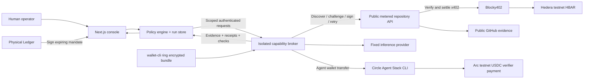

# AgentGDP

An operator console for agents that buy evidence, pay for verification, and work within a human-defined spending mandate. Built for the **Ledger AI Agents x Ledger**, **Hedera AI & Agentic Payments**, and **Arc Best Agentic Economy Application with Circle Agent Stack** tracks at ETHOnline 2026.

**Status:** runnable rehearsal and implemented live adapters. Local tests and an unpaid HTTP 402 challenge do **not** establish a paid testnet request or physical Ledger approval. See the [submission evidence checklist](docs/submission.md) before claiming qualification.

## Run the application

Use Node.js 22.12+ and npm. Native Ledger HID dependencies may need platform USB build tools.

```sh
npm ci
npm run dev
```

Open http://127.0.0.1:3000. Rehearsal works without environment variables, wallet funding or a Ledger device. Repository data is an explicitly labeled fixture, report text is a template, and receipts say simulated with no chain hash. Changing to live mode never falls back to rehearsal. If you set `APP_ORIGIN`, use that exact origin in your browser.

1. Create a research job with one to three GitHub `owner/repository` names.
2. Set separate HBAR and USDC purchase allowances, a data unit-price cap, permitted providers, and expiry.
3. Run the job: mandate → discovery → data purchase → report → verification.
4. For the intervention demo, step through discovery, raise provider prices before purchase, then advance to the blocked request.
5. Approve the larger allowance (explicitly simulated in rehearsal), then resume.
6. Inspect the checked evidence, two payment receipts and activity history. Export the JSON evidence pack.

## Architecture and payment flow



The data service charges **per repository**, so one repository costs one unit and three cost three units. The planner selects the cheapest permitted quote. Price increases can trigger rerouting or require a new mandate. Verification is a separate fixed-fee job paid in Arc USDC. Network fees are **not included** in purchase allowances.

See [architecture and trust boundaries](docs/architecture.md), [Hedera setup](docs/hedera-setup.md) and [broker, Circle and Ledger setup](docs/broker-setup.md).

## Live setup

1. Start the public evidence service using `.env.services.example` and `npm run data-service`. Set a distinct Hedera testnet recipient and its public HTTPS URL. It needs no payer private key.
2. Under a separate private OS account, provision Ledger Key Ring and its encrypted inference/Hedera credential bundle. Complete Circle testnet OTP login yourself, fund the agent wallet, and pin the verifier recipient. Follow `docs/broker-setup.md`.
3. Start the broker with `npm run broker`; do not expose its loopback port publicly. Keep its files, ring password and Circle session inaccessible to the application/model account.
4. Copy `.env.example` to `.env.local` for Next. Configure the private broker connection, public service URL, pinned Ledger controller and strong operator/session secrets. Restart Next.
5. Authenticate in the Connections view with your operator token. The app enables live runs only after the broker reports readiness. Configuration readiness is not settlement proof.
6. For approval, export the exact request message, run `npm run ledger:approve -- /absolute/path/approval.json` on the Ledger-connected machine and paste the resulting signature.
7. Complete the job and export receipts. Verify transaction IDs in HashScan and ArcScan, then capture the 2–4 minute demo.

LedgerJS is used for the physical personal-message signature; Key Ring uses the required Ledger Agent Stack `wallet-cli ring`. Circle signs with its own Agent Wallet infrastructure, **not Ledger**. No cross-chain bridge or atomic settlement is claimed.

## Tests and build

```sh
npm test
npm run typecheck
npm run build
npm start
```

Tests cover budget and expiry enforcement, quote changes, approved signer/run binding and replay, receipt validation, session ownership, concurrent advances, interrupted payments, broker lifetime caps and API/payment validation. Hardware, externally paid requests and browser behavior have separate verification records in `docs/submission.md`.

With the app running, `npm run test:smoke` exercises the HTTP workflow in a separate rehearsal session, including blocked live access, price shock, approval, report, receipts and export. It creates one simulated run and never transfers funds.

The dependency audit on September 7 reported zero high/critical advisories after compatible transitive patches, with 9 low and 7 moderate advisories remaining. Recheck the audit before deployment; passing application tests is not a claim that every dependency is vulnerability-free.

## Deployment

Use a long-running Node process with a persistent private volume for `AGENTGDP_DATA_DIR`. This MVP uses one serialized local store; **do not deploy multiple replicas or ephemeral serverless storage**. Run the data service as a separate HTTPS process with a durable `DATA_SERVICE_DATA_DIR`. Run the trusted broker on the Ledger-enrolled private host; reach it over a private authenticated tunnel from the app host. The browser never contacts the broker directly.

Set `APP_ORIGIN` to the actual public origin and `COOKIE_SECURE=true` behind HTTPS. Serve the app behind a reverse proxy, set a strong `SESSION_SECRET`, and preserve all broker/payment journals across deployments. App, data service and broker must use distinct OS permissions. A public demo can run rehearsal only with live configuration omitted.

## Project navigation

- `src/components/`: interactive Next.js console.
- `src/lib/engine.ts`, `policy.ts`, `store.ts`: mandate, stage machine, audit and persistence.
- `src/app/api/`: session-scoped run actions and operator authentication.
- `services/data-service.ts`: public discovery, metered quotes, native Hedera x402 endpoint.
- `services/broker.ts`: isolated credentials and scoped capabilities.
- `src/lib/integrations/`: Ledger Key Ring, Circle Arc and Hedera adapters.
- `scripts/ledger-approve.ts`: real USB hardware approval flow.
- `docs/`: approved plan, submission matrix, demo script, references and limitations.

## Attribution and eligibility

The user directed the product and flow; AI subagents assisted implementation, tests, documentation and illustration. See [AI and prior-work disclosure](docs/ai-disclosure.md). The current UI follows the user-selected Foundation reference on Mobbin; exact screenshots and typography inferences are listed in `docs/ui-references.md`. No sponsor logos or fictional settlement evidence are used.

The September 3 research paper predates the event. Whether it constitutes disallowed prior project-specific design for the Classic track remains an organizer decision. New implementation is dated in commit history; this repository does not represent eligibility as confirmed.
