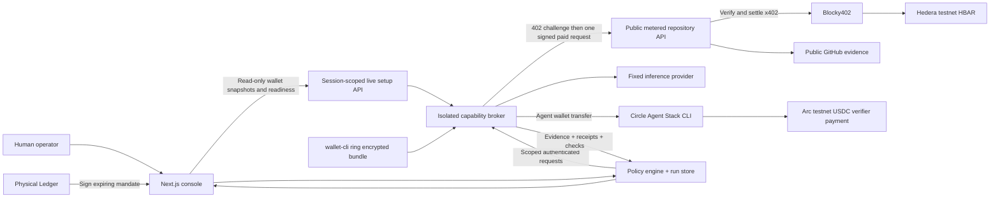

# Obolos

**Work, within limits.** Agents buy evidence and pay for verification. Humans control their spending authority.

[Source code](https://github.com/saiisback/obolos) · [Live setup](docs/live-setup.md) · [Architecture](docs/architecture.md) · [Submission checklist](docs/submission.md) · [Demo script](docs/demo-script.md)


An operator console for agents that buy evidence, pay for verification, and work within a human-defined spending mandate. Built for the **Ledger AI Agents x Ledger**, **Hedera AI & Agentic Payments**, and **Arc Best Agentic Economy Application with Circle Agent Stack** tracks at ETHOnline 2026.

**Status:** runnable rehearsal, implemented live adapters, and an operator-only Connections view for real wallet snapshots, readiness and saved live evidence. Configuration, local checks and an unpaid HTTP 402 challenge do **not** establish a paid testnet request, physical Ledger approval or track qualification. See the [submission evidence checklist](docs/submission.md) before claiming qualification.

## One workflow, three tracks

A user asks: *Compare these three developer tools using current repository activity and produce a checked report.* Obolos discovers approved service quotes, buys repository evidence, generates a report and pays for source checks. A quote above the mandate pauses execution until a human authorizes the increase.

| Target track | Integration in Obolos | Evidence still needed |
|---|---|---|
| Ledger — AI Agents x Ledger | `wallet-cli ring` protects broker secrets; a physical Ledger signs spending-limit increases; the backend retains and verifies the authorization | Device provisioning, real hardware demonstration and completed tooling feedback |
| Hedera — AI & Agentic Payments | Per-repository HBAR pricing, native x402 challenges, Blocky402 settlement and a consuming planner | Public HTTPS service and a real paid request with matching receipt |
| Circle — Best Agentic Economy Application with Circle Agent Stack | Circle Agent Wallet pays the verification capability in USDC on Arc testnet | Funded agent wallet, confirmed transfer and narrated demo/presentation |

The frontend and backend use **Next.js, React and TypeScript**. Separate Node services implement the metered API and private capability broker. The interface uses the user-selected Foundation reference on Mobbin, black-and-white surfaces, orange actions and an original flat illustration.

## Run the application

Use Node.js 22.12+ and npm. The project pins Wallet CLI 2.1.0 locally, so a global installation is not required. Native Ledger HID dependencies may need platform USB build tools; private broker deployments install their own dependencies.

```sh
git clone https://github.com/saiisback/obolos.git
cd obolos
npm ci
npm run dev
```

Open http://127.0.0.1:3000. Rehearsal works without environment variables, wallet funding or a Ledger device. Repository data is an explicitly labeled fixture, report text is a template, and receipts say simulated with no chain hash. Changing to live mode never falls back to rehearsal. If you set `APP_ORIGIN`, use that exact origin in your browser.

1. Create a research job with one to three GitHub `owner/repository` names.
2. Set separate HBAR and USDC purchase allowances, a data unit-price cap, permitted providers, and expiry.
3. Run the job: mandate → discovery → data purchase → report → verification.
4. For the intervention demo, step through discovery, raise provider prices before purchase, then advance to the blocked request.
5. Approve the larger allowance (explicitly simulated in rehearsal), then resume.
6. Inspect the structural/source checks, payment receipts and activity history. Export the JSON evidence pack; saved authorizations remain available after an approval is consumed.

## Architecture and payment flow



The on-chain part is payment settlement on Hedera and Arc. The model, planner, broker, facilitator, Circle infrastructure and local journal remain off-chain/trusted dependencies; this is not a fully decentralized agent runtime. Verification checks evidence structure, sources, timestamps and coverage, not the truth of every generated sentence.

The data service charges **per repository**, so one repository costs one unit and three cost three units. The planner selects the cheapest permitted quote. Price increases can trigger rerouting or require a new mandate. Verification is a separate fixed-fee job paid in Arc USDC. Network fees are **not included** in purchase allowances.

See [architecture and trust boundaries](docs/architecture.md), [Hedera setup](docs/hedera-setup.md) and [broker, Circle and Ledger setup](docs/broker-setup.md).

## Live setup

Follow the [step-by-step credential and wallet guide](docs/live-setup.md). It distinguishes public addresses from private credentials and keeps setup actions with the operator.

1. Configure and start the Hedera evidence service with its recipient, persistent journal and matching public URL.
2. Enroll the private broker using Ledger Ring and the **Sync** device app. Encrypt the inference credential and HBAR payer key; inject the Ring password from the operator keychain.
3. Use the **Ethereum** device app to derive and confirm the separate controller address. Pin it and its derivation path before requesting a signature.
4. Complete Circle CLI **agent/testnet email OTP** login yourself under the broker account. Select and fund its Arc wallet, then pin the verification recipient. This CLI path needs no Circle API key or imported Circle private key.
5. Start the private broker and app with their independent tokens. Run `npm run preflight`, then authenticate in **Connections** and refresh wallet/readiness details. Unknown balances remain unavailable; balances and purchase allowances are different values.
6. Create a live run. If authority must increase, download its approval JSON, run `npm run ledger:approve -- /absolute/path/approval.json`, review the physical Ledger prompt and submit the signature. Approved messages and signatures are saved in the run export.
7. Inspect actual settled receipt IDs in HashScan and ArcScan. Record the physical device, live paid flow and developer-experience feedback before submission.

Key Ring protects stored broker secrets; only the trusted broker decrypts them in memory. LedgerJS performs physical Ethereum personal-message approval. Circle Agent Wallet uses its own MPC/session infrastructure, **not Ledger**, to sign Arc payments. No bridge or atomic cross-chain settlement is claimed.

The Connections view is read-only wallet management: authenticated public addresses, recipients, exact HBAR/USDC balance strings, sources/timestamps, explorer/faucet links and session-owned receipt/authorization counts. It does not import keys, connect a replacement browser wallet, fund accounts or mark external submission requirements complete.

## Tests and build

```sh
npm test
npm run typecheck
npm run build
npm start
```

Tests cover budget and expiry enforcement, quote changes, approved signer/run binding and replay, receipt validation, session ownership, concurrent advances, interrupted payments, broker lifetime caps and API/payment validation. Hardware, externally paid requests and browser behavior have separate verification records in `docs/submission.md`.

`npm run preflight` inspects local configuration, matching values and executable/file presence without executing CLIs, decrypting the bundle or contacting the network. Run it only from a trusted setup context already authorized to read all three environment files; do not copy private broker configuration into the app account. It does not establish login, funding, hardware use or settlement.

With the app running, `npm run test:smoke` exercises the HTTP workflow in a separate rehearsal session, including blocked live access, price shock, approval, report, receipts and export. It creates one simulated run and never transfers funds.

The dependency audit on September 7 reported zero high/critical advisories after compatible transitive patches, with 9 low and 7 moderate advisories remaining. Recheck the audit before deployment; passing application tests is not a claim that every dependency is vulnerability-free.

## Deployment

Use a long-running Node process with a persistent private volume for `OBOLOS_DATA_DIR`. This MVP uses one serialized local store; **do not deploy multiple replicas or ephemeral serverless storage**. Run the data service as a separate HTTPS process with a durable `DATA_SERVICE_DATA_DIR`. Run the trusted broker on the Ledger-enrolled private host; reach it over a private authenticated tunnel from the app host. The browser never contacts the broker directly.

Set `APP_ORIGIN` to the actual public origin and `COOKIE_SECURE=true` behind HTTPS. Serve the app behind a reverse proxy, set a strong `SESSION_SECRET`, and preserve all broker/payment journals across deployments. App, data service and broker must use distinct OS permissions. A public demo can run rehearsal only with live configuration omitted.

Existing installations retain their data directory, cookies, signed messages and payment journals across the rename. `OBOLOS_DATA_DIR` is the current setting; the previous environment variable remains a fallback. Keep already-provisioned Ring key names and file paths unchanged. The original Circle idempotency namespace is intentionally stable so renaming the product cannot create a second payment identity.

## Project navigation

- `src/components/`: interactive Next.js console.
- `src/lib/engine.ts`, `policy.ts`, `store.ts`: mandate, stage machine, audit and persistence.
- `src/app/api/`: session-scoped run actions and operator authentication.
- `services/data-service.ts`: public discovery, metered quotes, native Hedera x402 endpoint.
- `services/broker.ts`: isolated credentials and scoped capabilities.
- `src/lib/integrations/`: Ledger Key Ring, Circle Arc and Hedera adapters.
- `scripts/ledger-approve.ts`: physical USB hardware approval flow; pending JSON messages become saved authorization proofs after validation.
- `src/lib/live-readiness.ts`, `src/lib/integrations/wallets.ts`: readiness aggregation and authenticated, read-only testnet balance snapshots.
- `docs/live-setup.md`: public address map, secret locations and operator setup sequence.
- `docs/`: approved plan, submission matrix, demo script, references and limitations.

## Attribution and eligibility

The user directed the product and flow; AI subagents assisted implementation, tests, documentation and illustration. See [AI and prior-work disclosure](docs/ai-disclosure.md). The current UI follows the user-selected Foundation reference on Mobbin; exact screenshots and typography inferences are listed in `docs/ui-references.md`. No sponsor logos or fictional settlement evidence are used.

The September 3 research paper predates the event. Whether it constitutes disallowed prior project-specific design for the Classic track remains an organizer decision. New implementation is dated in commit history; this repository does not represent eligibility as confirmed.
