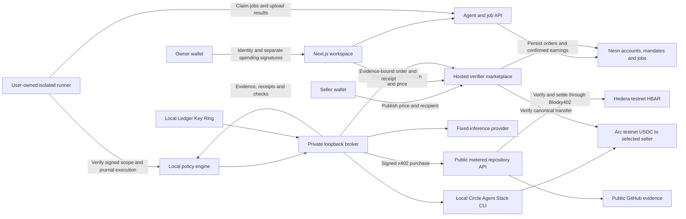

# Obolos

**Work, within limits.** Agents buy evidence and pay for verification. Humans control their spending authority.

[Public app](https://obolos.app) · [Operator demo](https://obolos.app/demo) · [Source code](https://github.com/saiisback/obolos) · [Live setup](docs/live-setup.md) · [Speculos setup](docs/speculos-setup.md) · [Architecture](docs/architecture.md) · [Submission checklist](docs/submission.md) · [Video footage — human narration required](docs/presentation/obolos-human-narration-visual-bed.mp4) · [Presentation PDF](docs/presentation/obolos-presentation.pdf) · [Demo script](docs/demo-script.md)


A self-service workspace for research agents with wallet accounts, scoped API access, and signed spending limits. User-owned runners execute through private local brokers; the original operator console remains available at `/demo`. Built for the **Ledger AI Agents x Ledger**, **Hedera AI & Agentic Payments**, and **Arc Best Agentic Economy Application with Circle Agent Stack** tracks at ETHOnline 2026.

**Verified self-service testnet run:** the deployed account, agent, signed-mandate and isolated-runner path purchased one repository record for **0.001 HBAR**, generated a report and paid **0.05 USDC** for verification. Both payments were independently checked on chain. The bounded test used a generated EOA owner and an explicitly authorized funded broker with Speculos credential retrieval. See [run evidence](docs/evidence/2026-09-09-self-service-testnet.md), [self-service setup](docs/self-service-setup.md) and [private runner setup](docs/runner-setup.md).

**Historical operator evidence:** a complete testnet run bought three records for **0.003 HBAR**, generated a report with GPT-5 nano and paid **0.05 USDC** for verification on Arc. A separate public HTTPS purchase settled **0.001 HBAR**. A real chat-approved Speculos mandate increase also settled **0.008 HBAR**, and its older Arc intent was recovered under explicit user authorization and settled for **0.05 USDC**. See the [evidence matrix](docs/submission.md) and [reconciliation record](docs/evidence/2026-09-08-arc-reconciliation.md).

**Submission video correction (September 9, 2026):** ETHGlobal prohibits synthetic/AI voiceovers and speeding up footage. The earlier narrated MP4 is an internal preview and **must not be submitted**. The [visual bed and human recording guide](docs/presentation.md) require the team’s own voice before upload. See the [official video rules](https://ethglobal.com/events/ethonline2026/info/details).

The application and x402 service support native Vercel hosting with Neon. Paid execution still requires the owner’s local runner and funded broker to be online. A wallet signature does not prove physical Ledger use; Speculos is emulated development signing. Ledger acceptance and prior-paper eligibility remain external decisions.

**Marketplace release:** signed-in sellers can publish hosted metric-verification services and receive Arc test USDC directly. Buyers select a seller in a v2 spending mandate; orders bind the purchased evidence, report, recipient and price. The public service verifies settlement, and the workspace checks both payment proofs before showing chain-confirmed results. [Open the marketplace](https://obolos.app/marketplace) · [Setup and API flow](docs/marketplace-setup.md). **Paid release verified:** a separately signed-in buyer selected a seller, bought fresh evidence and completed a 0.05 test-USDC order with all seven report checks passing. [Receipts and validation](docs/evidence/2026-09-10-marketplace-testnet.md).

## One workflow, three tracks

A user asks: *Compare these three developer tools using current repository activity and produce a checked report.* Obolos discovers approved service quotes, buys repository evidence, generates a report and pays for source checks. A quote above the mandate pauses execution until a human authorizes the increase.

| Target track | Integration in Obolos | Evidence still needed |
|---|---|---|
| Ledger — AI Agents x Ledger | `wallet-cli ring` integration plus explicit Speculos development support using upstream commands, real Sync/Ethereum apps and Ledger staging; signed mandate increases | Accepted emulator mandate and retained signature verified; sponsor decision and delivery of tooling feedback remain |
| Hedera — AI & Agentic Payments | Per-repository HBAR pricing, native x402 challenges, Blocky402 settlement and a consuming planner | Public HTTPS 402 and paid request verified; retain the narrated demo artifact and host availability |
| Circle — Best Agentic Economy Application with Circle Agent Stack | Circle Agent Wallet pays the verification capability in USDC on Arc testnet | Fresh self-service USDC payment verified; historical intent also reconciled and settled |

The frontend and backend use **Next.js, React and TypeScript**. Separate Node services implement the metered API and private capability broker. The application interface uses the user-selected Foundation reference on Mobbin, black-and-white surfaces, orange actions and an original flat illustration. The landing page uses the later supplied full-screen video and dot-matrix design brief.

## Run the application

Use Node.js 22.12+ and npm. The project pins Wallet CLI 2.1.0 locally, so a global installation is not required. Native Ledger HID dependencies may need platform USB build tools; private broker deployments install their own dependencies.

```sh
git clone https://github.com/saiisback/obolos.git
cd obolos
npm ci
npm run dev
```

Open http://127.0.0.1:3000 for the landing page, or http://127.0.0.1:3000/demo for the operator console. Rehearsal works in the operator console without environment variables, wallet funding or a Ledger device. Repository data is an explicitly labeled fixture, report text is a template, and receipts say simulated with no chain hash. Changing to live mode never falls back to rehearsal. If you set `APP_ORIGIN`, use that exact origin in your browser. Wallet accounts require [Neon setup](docs/self-service-setup.md).

For self-service work, follow [account setup](docs/self-service-setup.md), then pair a runner and sign a bounded mandate. The following steps describe the separate operator demonstration:

1. Create a research job with one to three GitHub `owner/repository` names.
2. Set separate HBAR and USDC purchase allowances, a data unit-price cap, permitted providers, and expiry.
3. Run the job: mandate → discovery → data purchase → report → verification.
4. For the intervention demo, step through discovery, raise provider prices before purchase, then advance to the blocked request.
5. Approve the larger allowance (explicitly simulated in rehearsal), then resume.
6. Inspect the structural/source checks, payment receipts and activity history. Export the JSON evidence pack; saved authorizations remain available after an approval is consumed.

## Architecture and payment flow



The on-chain part is payment settlement on Hedera and Arc. The model, planner, broker, facilitator, Circle infrastructure and local journal remain off-chain/trusted dependencies; this is not a fully decentralized agent runtime. The marketplace verifier checks model metric claims against purchased evidence, sources, timestamps and coverage. It does not certify free-text recommendations. New v2 marketplace results are checked independently against Hedera settlement and fulfilled Arc orders; legacy v1 receipts retain their runner-confirmed label.

The data service charges **per repository**, so one repository costs one unit and three cost three units. The planner selects the cheapest permitted quote. Price increases can trigger rerouting or require a new mandate. Verification is a separate job paid in Arc USDC at the selected seller’s signed price. Network fees are **not included** in purchase allowances.

See [architecture and trust boundaries](docs/architecture.md), [Hedera setup](docs/hedera-setup.md) and [broker, Circle and Ledger setup](docs/broker-setup.md).

The [first paid testnet run](docs/evidence/2026-09-08-first-paid-run.md) completed on September 8, 2026: three repository records purchased for 0.003 HBAR through Blocky402, GPT-5 nano report generation, and verification settled for 0.05 USDC on Arc. Transaction links and the application export are included.

## Live setup

Without hardware, follow [Speculos development setup](docs/speculos-setup.md). Real staging authentication, password-protected Ring enrollment, encryption/decryption and emulator message signing have been verified. [Execution evidence](tools/ledger-speculos/ring-evidence.json) includes rejection of altered ciphertext, wrong domains and wrong passwords. This does not establish physical-device security or bounty eligibility.

Follow the [step-by-step credential and wallet guide](docs/live-setup.md). It distinguishes public addresses from private credentials and keeps setup actions with the operator.

For a fresh local setup, `npm run setup:local` creates the three ignored environment files with private permissions, matching internal tokens and installed CLI paths. It preserves existing application sessions and refuses to overwrite configuration. It does not create wallets, provision Ledger Ring, log in to Circle or move funds. The local same-user layout is for development; use a dedicated broker account for credential isolation.

1. Configure and start the Hedera evidence service with its recipient, persistent journal and matching public URL.
2. Enroll the private broker using Ledger Ring and the **Sync** device app. Encrypt the inference credential and HBAR payer key; inject the Ring password from the operator keychain.
3. Use the **Ethereum** device app to derive and confirm the separate controller address. Pin it and its derivation path before requesting a signature.
4. Complete Circle CLI **agent/testnet email OTP** login yourself under the broker account. Select and fund its Arc wallet, then pin the verification recipient. This CLI path needs no Circle API key or imported Circle private key.
5. Start the private broker and app with their independent tokens. Run `npm run preflight`, then authenticate in **Connections** and refresh wallet/readiness details. Unknown balances remain unavailable; balances and purchase allowances are different values.
6. Create a live run. If authority must increase, download its approval JSON, run `npm run ledger:approve -- /absolute/path/approval.json`, review the selected physical Ledger or explicitly labelled Speculos prompt and submit the signature. Approved messages and signatures are saved in the run export.
7. Inspect actual settled receipt IDs in HashScan and ArcScan. Record the selected signer, disclose emulator use, and retain paid-flow evidence and developer feedback before submission.

Key Ring protects stored broker secrets; only the trusted broker decrypts them in memory. LedgerJS performs Ethereum personal-message approval through USB or the disclosed Speculos adapter. Circle Agent Wallet uses its own MPC/session infrastructure, **not Ledger**, to sign Arc payments. No bridge or atomic cross-chain settlement is claimed.

The Connections view is read-only wallet management: authenticated public addresses, recipients, exact HBAR/USDC balance strings, sources/timestamps, explorer/faucet links and session-owned receipt/authorization counts. It does not import keys, connect a replacement browser wallet, fund accounts or mark external submission requirements complete.

## Tests and build

```sh
npm test
npm run typecheck
npm run build
npm start
```

Tests cover budget and expiry enforcement, quote changes, approved signer/run binding and replay, receipt validation, session ownership, concurrent advances, interrupted payments, broker lifetime caps and API/payment validation. Hardware, externally paid requests and browser behavior have separate verification records in `docs/submission.md`.

`npm run preflight` inspects local configuration, matching values and executable/file presence without executing CLIs, decrypting the bundle or contacting the network. Run it only from a trusted setup context already authorized to read all three environment files; do not copy private broker configuration into the app account. It does not establish login, funding, hardware use or settlement.

With the app running, `npm run test:smoke` exercises the HTTP workflow in a separate rehearsal session, including blocked live access, price shock, approval, report, receipts and export. It creates one simulated run and never transfers funds.

The dependency audit on September 7 reported zero high/critical advisories after compatible transitive patches, with 9 low and 7 moderate advisories remaining. Recheck the audit before deployment; passing application tests is not a claim that every dependency is vulnerability-free.

## Deployment

The repository’s root `vercel.json` builds the native Next.js application. Neon stores account sessions, agent credentials, mandates, jobs, and the x402 service’s durable quote/payment state. Configure the server-side `DATABASE_URL` and exact `APP_ORIGIN`, apply migrations, and set the public service recipient and its independent operator control token. See [self-service setup](docs/self-service-setup.md). The native public deployment passed account verification and a [bounded funded self-service run](docs/evidence/2026-09-09-self-service-testnet.md) on September 9, 2026.

The user’s runner and broker stay on a private host with their durable journals and local wallet/provider credentials. Do not copy wallet keys, Circle sessions, Ring passwords, inference credentials, or broker secrets into Vercel or Neon. A local runner needs outbound access to the platform and configured services, with its broker bound to loopback.

The [older Vercel proxy](deploy/vercel-proxy/README.md) and [standalone data service](deploy/data-service/README.md) remain legacy deployment options. Local file-backed services require long-running processes and persistent private volumes; they must not share or clone a payment journal across replicas. Preserve all prior journals and reconcile uncertain payments manually.

Existing installations retain their data directory, cookies, signed messages and payment journals across the rename. `OBOLOS_DATA_DIR` is the current setting; the previous environment variable remains a fallback. Keep already-provisioned Ring key names and file paths unchanged. The original Circle idempotency namespace is intentionally stable so renaming the product cannot create a second payment identity.

## Project navigation

- `src/components/platform/`: self-service account, agent, runner, mandate and job interfaces.
- `src/lib/platform/`, `db/migrations/`: Neon-backed control plane and native x402 service.
- `services/agent-runner.ts`, `src/lib/runner/`: isolated execution, signed-scope enforcement and durable recovery.
- `src/components/dashboard.tsx`: separate operator demonstration.
- `src/lib/engine.ts`, `policy.ts`, `store.ts`: mandate, stage machine, audit and persistence.
- `src/app/api/`: session-scoped run actions and operator authentication.
- `services/data-service.ts`: public discovery, metered quotes, native Hedera x402 endpoint.
- `services/broker.ts`: isolated credentials and scoped capabilities.
- `src/lib/integrations/`: Ledger Key Ring, Circle Arc and Hedera adapters.
- `scripts/ledger-approve.ts`: USB or explicitly labelled Speculos approval flow; pending JSON messages become saved authorization proofs after validation.
- `src/lib/live-readiness.ts`, `src/lib/integrations/wallets.ts`: readiness aggregation and authenticated, read-only testnet balance snapshots.
- `docs/live-setup.md`: public address map, secret locations and operator setup sequence.
- `docs/`: approved plan, submission matrix, demo script, references and limitations.

## Attribution and eligibility

The user directed the product and flow; AI subagents assisted implementation, tests, documentation and illustration. See [AI and prior-work disclosure](docs/ai-disclosure.md). The workspace follows the user-selected Foundation reference on Mobbin; exact screenshots and typography inferences are listed in `docs/ui-references.md`. The landing page follows the user’s later supplied video-background brief, with product facts replacing illustrative adoption and performance claims. No sponsor logos or fictional settlement evidence are used.

The September 3 research paper predates the event. Whether it constitutes disallowed prior project-specific design for the Classic track remains an organizer decision. New implementation is dated in commit history; this repository does not represent eligibility as confirmed.
