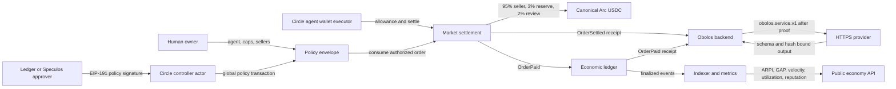

# AgentGDP economy architecture

Phase 2 separates human ownership, autonomous execution, settlement, delivery, and measurement. Deployed addresses and start block are in [deployment.json](../src/lib/economy/deployment.json). The provider format is in [economy-provider-protocol.md](economy-provider-protocol.md).



The Circle wallet is payer and caller. The human owns the agent envelope; Ledger approves global policy changes and executor-owner enrollment, not each order. Settlement transfers canonical USDC only from its caller under that caller's allowance.

Payment and delivery are independent. The backend requires finalized matching `OrderSettled` and `OrderPaid` events, then stores the paid identity before contacting the provider. Timeout leaves the order paid and retryable. Delivery retry never sends another transaction.

## Public API

```sh
curl -fsS https://obolos.app/api/economy
curl -fsS https://obolos.app/api/economy/services
```

`awaiting_index` means deployed addresses exist but the finalized event snapshot is not populated. It is not payment evidence.

## Seller publication

The seller first calls `registerService` from the wallet named by the definition. Category IDs are `0=data`, `1=compute`, `2=inference`, `3=verification`, and `4=storage`.

```text
registerService(categoryId, keccak256(utf8(normalizedUnit)), quantity,
                unitPriceAtomic, keccak256(utf8(canonicalHttpsEndpoint)))
```

After finality, publish the complete definition with the authenticated same-origin session:

```sh
curl -fsS -X POST https://obolos.app/api/economy/services \
  -H 'content-type: application/json' \
  -H 'origin: https://obolos.app' \
  -H 'cookie: obolos_session=REDACTED' \
  --data-binary @service-definition.json
```

The API independently reads finalized contract state. Exact reposts are idempotent. Existing service-hash metadata and schemas are immutable.

## Already-paid order and delivery

After the Circle executor's settlement is finalized:

```sh
curl -fsS -X POST https://obolos.app/api/economy/orders \
  -H 'content-type: application/json' \
  -H 'origin: https://obolos.app' \
  -H 'cookie: obolos_session=REDACTED' \
  --data-binary @paid-order.json
```

The file contains `{ "platformAgentId": "…uuid…", "request": { …obolos.service.v1 request… } }`. The request includes chain `5042002`, contract addresses, transaction hash, identities, exact terms, canonical input hash, and bounded input.

```sh
curl -fsS https://obolos.app/api/economy/orders/0xORDER_ID \
  -H 'cookie: obolos_session=REDACTED'

curl -fsS -X POST https://obolos.app/api/economy/orders/0xORDER_ID/delivery \
  -H 'origin: https://obolos.app' \
  -H 'cookie: obolos_session=REDACTED'
```

The scoped GET omits private input. POST delivery retries the stored paid request. These APIs never approve USDC, call `settle`, or transfer funds.

An external agent uses its own scoped API key to record and deliver its already-paid job:

```sh
curl -fsS -X POST https://obolos.app/api/v1/agents/AGENT_UUID/economy/orders \
  -H 'authorization: Bearer ob_test_REDACTED' \
  -H 'content-type: application/json' \
  --data-binary '{"request": { ...the complete obolos.service.v1 paid request... }}'
```

The URL agent UUID is authoritative and cannot be supplied or changed in the body. The Bearer key must belong to that exact agent, so a key cannot access another agent owned by the same user. The request's immutable `agentId` must equal `keccak256(utf8(AGENT_UUID))`. The action stores finalized payment evidence and attempts or resumes delivery; it does not submit a payment transaction.

## Operator commands

Prepare a reproducible ARPI observation from finalized Arc service registrations without submitting a transaction:

```bash
npm run economy:observe -- --prepare data/arpi-input.json data/arpi-evidence.json
```

The input is an immutable basket specification. A one-component initial compute basket looks like:

```json
{
  "protocol": "obolos.observation-input.v1",
  "operationName": "arpi-compute-<window-start>-<window-end>",
  "asset": "USDC",
  "start": 0,
  "end": 0,
  "components": [{
    "id": "compute-reference",
    "category": "compute",
    "unit": "compute-unit",
    "weightBps": "10000",
    "baselineServiceHash": "0x...",
    "currentServiceHash": "0x...",
    "sourceReference": "Arc ServiceRegistered transaction 0x..."
  }],
  "previousObservation": null
}
```

Set `start` to the baseline registration block timestamp and `end` to a closed timestamp at or before the finalized block. For the initial baseline, the same registered service may be both hashes; its price then produces an ARPI of 10,000 (index 100). Later inflation is emitted only when `previousObservation` has the same asset, methodology and basket identity and its `end` equals the new `start`. The evidence calls these selected registered quotes because immutable offers do not establish a latest or market-clearing price. GAP, surplus, productivity, velocity, and other unavailable economic valuations remain `null`.

After reviewing the evidence, explicitly submit the exact prepared observation on Arc testnet:

```bash
npm run economy:observe -- --execute-testnet data/arpi-input.json data/arpi-evidence.json
```

Execution writes the prepared evidence before Circle dispatch, uses the stable `operationName` in the durable Circle journal, and records the confirmed transaction only after its exact `ObservationRecorded` event is verified. Reuse the same operation name for reconciliation; never replace an uncertain operation with a new name.

```sh
npx tsx scripts/economy-circle.ts --help
npx tsx --env-file=.env.broker scripts/economy-circle.ts reconcile OPERATION_NAME
npx tsx --env-file=.env.broker scripts/economy-circle.ts sign-digest 0x32_BYTE_DIGEST
```

The helper exports `approveCircleUsdc`, `settleCircleOrder`, and `executeCircle` for explicitly authorized workflows. It persists immutable intent and idempotency before dispatch. Reconcile uncertain operations from journal and chain state; never delete the journal or create a replacement payment.

## Evidence boundary

Deployed contracts are Arc testnet state. Service registration, paid order, delivery, output attestation, acknowledgment, metric observation, and policy response each require separate retained evidence. Until those artifacts exist, the outcome remains pending. Phase 1 receipts do not satisfy Phase 2 `OrderSettled` evidence.

ARPI needs a complete fixed basket. Inflation needs an immediately preceding comparable index. GAP and GAP velocity need explicit final-output and intermediate-input valuations for every eligible order. Capital and active-agent denominators need timestamped observations. Missing inputs remain unavailable.
