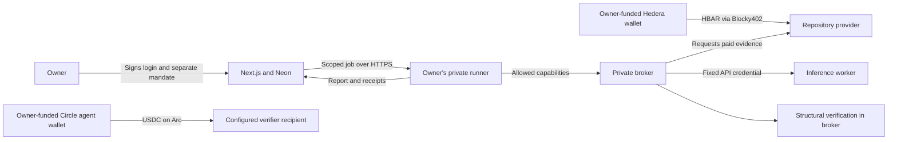

# Obolos: product, marketplace and prize-readiness audit

Reviewed September 10, 2026 against commit `4b45eac`, the deployed public service, current official event pages, source code and retained execution evidence. This is an engineering assessment, not an eligibility ruling. No payments, sponsor messages or submissions were made during this audit.

## Assessment

Obolos is a functioning testnet research-payment MVP with a public account platform, real metered data sales, real Circle USDC payments, a scoped credential broker and owner-authorized private execution. It has progressed substantially beyond a simulated dashboard.

It is not yet an open agent economy or a turnkey hosted agent product. Its service catalog has two pricing options operated by the same provider. The report verifier runs inside the trusted broker. New users must provision their own funded private runner. The chains settle payments; they do not adjudicate report correctness, enforce the application's mandates, or coordinate an atomic cross-chain job.

Hedera is the strongest implementation fit. Circle/Arc has demonstrated technical integration but its economic counterparty story can be stronger. Ledger has substantial protocol work, with unresolved acceptance of the disclosed Speculos/source-adapter setup and no physical-device security evidence. General event eligibility also needs attention because of the disclosed pre-event architecture paper.

## Fresh observations

| Check | September 10 observation | What it establishes |
|---|---|---|
| Public repository | `saiisback/obolos` is PUBLIC; default branch `main` | Public source is available. |
| Hosted accounts | `/api/account` returned `configured:true`, anonymous user | Account configuration is present; this read is not a new signed-login test. |
| Hosted data service | `/x402/health` returned `ready:true`, `storage:postgres` | Public service and price database responded. |
| Payment gate | Unpaid POST to `/x402/evidence/repo-standard` returned HTTP 402 with native HBAR terms and Blocky fee payer | A live challenge is available; this request did not spend. |
| Catalog | Standard 100000 tinybars/repository; Economy 120000 | Two current pricing entries, not two independent businesses. |
| Arc receipts | All three recorded verification transfers rechecked successfully on chain 5042002 | Each emitted exactly 50000 canonical USDC atomic units from the configured payer to verifier. |
| Hedera receipt | Self-service transfer rechecked through testnet mirror: SUCCESS | Payer debit and provider credit each matched 100000 tinybars. |
| Private broker journal | 6 settled data entries, 3 settled report entries, 3 settled verification entries; zero pending entries | The inspected operator journal has no remaining unresolved intent. This is not a scan of every possible runner or wallet. |
| Local availability | Port 4319 broker and port 3000 dev app did not respond; Docker daemon unavailable | This Mac is currently not serving private execution. Public Vercel hosting continues independently. |
| Tests | 184 passed; 7 database tests skipped | Current default suite passes. Database tests require their separate test DB. |
| TypeScript | `npm run typecheck` passed | Current checked-out source typechecks. |
| Existing visual bed | 234.9 seconds, 1280×720, video stream only | Fits the event duration/resolution bounds but has no narration and contains older product status. |

The earlier release evidence records 191 passing tests including a dedicated PostgreSQL run, 43 public account/API assertions, public desktop/mobile checks and a funded self-service execution. Those are historical September 9 checks, not rerun claims for September 10. See [account evidence](../evidence/2026-09-09-neon-accounts.md) and [self-service evidence](../evidence/2026-09-09-self-service-testnet.md).

## Current track mapping

Official rules and their current changes are collected in [the dated requirements research](../research/2026-09-10-prize-requirements.md). Partner choices are Hedera, Arc and Ledger. These fit the event's three-partner limit. Arc's agentic award is now listed as $3,500, of which $2,500 depends on deploying the same project to mainnet by September 30. Our current execution is testnet only. [Official prize page](https://ethglobal.com/events/ethonline2026/prizes)

### Hedera: AI & Agentic Payments

| Criterion | Assessment | Evidence or remaining work |
|---|---|---|
| Live Blocky402-gated service | Demonstrated | Native Next route `/x402`, persistent Neon settlement intents, actual 402 response and prior paid service requests. |
| Consuming agent completes paid request | Demonstrated | Self-service job `f2d61fa0-0561-4029-b150-99636cbe4795` purchased a repository and completed report/verification. Its Hedera transfer was rechecked today. |
| Public source and usable documentation | Present | Public repo, README, architecture, broker, Hedera and runner setup instructions. Older presentation/submission text needs synchronization. |
| Paid-request video | Partial | Original-speed purchase footage exists. A current narrated final demo is not established by the available artifacts. |

Our implementation also has per-repository metering and a public directory. These fit two bonus directions, subject to judge assessment. No implemented A2A/ACP negotiation, ERC-8004/HCS-14 identity, UCP protocol, HTS settlement, HCS audit anchoring or scheduled streaming was found. These are optional differentiators, not prerequisites to the core x402 case. [Hedera track](https://ethglobal.com/events/ethonline2026/prizes/hedera)

The data sold is a snapshot of public repository metadata: description, stars, forks, open issues, last push, language and license. It is not a full repository audit, commit-history analysis, security review, issue-resolution study or proprietary data feed. Its value today is the payment/control workflow more than exclusive data.

### Arc: Best Agentic Economy Application with Circle Agent Stack

| Criterion | Assessment | Evidence or remaining work |
|---|---|---|
| Real decision logic | Demonstrated | Deterministic planner checks actual prices, permitted providers, expiry, per-unit cap and separate currency limits. |
| Autonomous USDC settlement | Demonstrated | Circle Agent Wallet CLI executes verification payments on Arc; adapter checks chain, token, sender, recipient and amount. Three recorded transfers rechecked today. |
| Agent Stack integration | Present and exercised | Installed `@circle-fin/cli`, agent-wallet session, ARC-TESTNET wallet lookup and transfer. This is a CLI/session integration, not a Circle API-key integration. |
| Frontend/backend/diagram | Present | Next workspace, Neon API, private runner/broker and README/presentation diagrams. |
| Documentation/presentation/video | Partial | Source and deck exist; final narrated recording and updated presentation remain. |
| Conditional mainnet portion | Not met | No Arc mainnet deployment or mainnet settlement evidence. Network constants and wallet selection currently target testnet. |

Nanopayments, Paymaster and App Kits are not used. Their mention is contextual rather than a requirement to use all of them. Current award conditions must replace the earlier $1,667 assumption. [Arc track](https://ethglobal.com/events/ethonline2026/prizes/arc)

The weak point is not whether a transfer occurred: it did. The weak point is the verifier business model. The verification endpoint is a fixed capability in our own broker, paid to a configured recipient. We have not demonstrated a separately deployed seller accepting jobs, signing results, negotiating prices or receiving outcome-conditioned escrow. Payment precedes the verifier's structural checks; a negative check does not automatically refund the transfer.

### Ledger: AI Agents x Ledger

| Criterion or intended direction | Assessment | Evidence or remaining work |
|---|---|---|
| Key Ring central to credential access | Substantial implementation; qualification unconfirmed | Broker decrypts the Hedera/inference bundle through an upstream-derived Ring adapter using Ledger staging and real app protocol. It is not the stock CLI end-to-end hardware path. |
| Model cannot receive raw credentials | Implemented boundary | Model receives purchased evidence, no payer key, inference credential or capability token. The trusted broker still handles plaintext in memory. |
| Approval before increased authority | Demonstrated in operator workflow | Exact signed escalation, backend verification and retained Speculos signature. Ordinary self-service owner signatures have a separate authorization path. |
| Physical device security | Not demonstrated | Speculos is software emulation. A valid signature does not establish secure-element provenance. |
| Remote Key Ring enrollment | Not demonstrated as a finished feature | Vercel hosting and an outbound local runner do not equal enrolling a VPS/CI host into the Ring. |
| Tooling feedback | Written, external delivery unconfirmed | `docs/ledger-feedback.md` contains actual observations and reproduction details. |

The official developer page requires tooling/DX feedback and emphasizes device-backed trust and central Ring usage. It does not state a Speculos exemption. Emulator support for development must not be presented as confirmed bounty eligibility. [Ledger event requirements](https://developers.ledger.com/ethonline)

No new Hedera or Circle keys are inherently missing to reproduce the already completed configured workflow. The remaining Ledger question is an acceptance/provenance issue, not a missing API key.

## How the product and money move

1. The owner signs into `/login` using an injected EVM wallet. That wallet establishes account ownership; login alone authorizes no payment.
2. The owner creates a tenant-owned agent, issues an optional scoped API credential and pairs a private runner. Neither creating an agent nor entering a budget creates or funds a wallet.
3. The owner separately signs the agent's allowed repositories, provider scope, per-run allowances, unit price cap, run count and expiry. Current limits are 1–3 repositories, at most 10 runs and at most 24 hours per mandate.
4. The runner pins owner, agent and platform origin locally, validates the signature and asks the platform for fresh authorization before each paid capability.
5. The planner chooses an allowed affordable catalog entry. The broker signs native Hedera payment for the x402 challenge; Blocky settles it to the provider. The service retrieves GitHub evidence before submitting settlement.
6. The fixed inference worker writes the comparison from that evidence. Its provider charges the configured inference account separately; these costs are not settled through Hedera or included in the on-chain principal budget.
7. The broker pays the configured verifier recipient 0.05 test USDC through Circle, then runs source/integrity checks. The worker and verifier are roles in the workflow, not automatically separate businesses with their own treasuries.
8. The runner uploads the report, checks, spending and receipt references. The public workspace validates their shape and signed scope but labels them runner-confirmed. Its upload handler does not independently query both chains.

### Funding and unit economics

At the prices observed today, one Standard repository costs 0.001 test HBAR and one Economy repository costs 0.0012. A three-repository Standard job costs 0.003 test HBAR plus a separate 0.05 test USDC verification fee. Gas, inference, database and hosting costs are additional. HBAR and USDC cannot be added into one nominal balance without an explicit conversion assumption.

The owner funds the Hedera payer and Circle agent wallet independently. The repository service receives HBAR; the configured verification recipient receives USDC. There is no automatic worker payroll, revenue split, agent faucet, deposit account, bridge or treasury rebalance. The platform does not currently take a separately implemented marketplace commission. Testnet transfers establish functionality, not commercial revenue, customer demand or a profitable margin.

The two provider IDs are constrained in schemas, price tables and runner scope. Adding an arbitrary external seller requires more than inserting a card: registration, verified payout/endpoint ownership, endpoint trust rules, pricing/schema contracts, isolation, and purchaser authorization all need implementation. Today this is a curated paid-service workflow.

The current naming is also confusing: Economy costs more than Standard at the default prices while supplying the same fields. It serves as a fallback for price-shock demonstrations, but has no demonstrated quality, latency or product distinction that justifies its name or premium.

### What the chains decide

| Component | On-chain? | Meaning |
|---|---|---|
| HBAR and USDC transfer execution | Yes | Networks establish successful transfers and their amounts/addresses. |
| Login and mandate signatures | Verified off-chain | They establish control of the signer and specific allowed scope. |
| Budget and provider rules | No | Runner, platform and trusted broker enforce them. Principal caps exclude gas and inference billing. |
| Report and verifier reasoning | No | Off-chain computation; successful payment is not proof that every statement is correct. |
| Audit events | No | Local/database hash-linked records; not HCS-anchored or immutable against a fully compromised host. |
| Cross-chain job outcome | No | Sequential payments; no atomic rollback if a later stage fails. |

The verifier checks record shape, source URL, counts, timestamp validity/freshness, evidence integrity and repository coverage. A false sentence may still pass if it names the repositories and attaches unchanged evidence. The correct claim is “source and structural checks passed,” not “the blockchain verified this report.”

## Original six-stage flow: where it stands

| Planned step | Current outcome |
|---|---|
| Set mandate | Implemented in operator and self-service paths; their signing mechanisms differ. |
| Discover and buy metered inputs | Live and confirmed on Hedera. |
| Produce report, pay verification | Live model output and Arc payment confirmed; semantic fact checking remains limited. |
| Increase actual price | Operator evidence shows changed quotes, zero-spend blocking and selected fallback logic in source/tests. No independent multi-seller market has been proven. |
| Obtain Ledger-approved increase | Executed with disclosed Speculos in operator flow. Self-service blocked jobs require a new signed mandate and a new job; they do not yet resume the same job through the Ledger escalation flow. |
| Show proof | Reports, units, receipts, reasons and authorization exports exist. Public uploaded receipts remain runner-confirmed unless separately checked. |

This split between `/demo` and `/app` is a significant UX/product gap: the original operator demonstration has capabilities that are not yet one continuous self-service flow.

## What remains, in priority order

### Before treating the hackathon package as ready

1. Resolve the eligibility interpretation. `docs/ai-disclosure.md` records a September 3 project-specific architecture paper, while implementation commits begin September 7. The code starts within the event window, but the Classic rule covers prior designs/assets too. This requires accurate disclosure and an organizer decision; a rename or fresh implementation does not settle it. Ledger emulator acceptance is a separate sponsor decision.
2. Prepare current, human-narrated footage. Show the public account flow, signed spending scope, paid inputs, report/checks and both explorer receipts. Include the price-control proof without implying all historical clips were one uninterrupted run. Existing visual footage has no audio and predates the latest release.
3. Synchronize the presentation and evidence entry points. `docs/presentation.md`, `docs/presentation/index.html`, `docs/presentation/demo-transcript.md` and parts of `docs/submission.md` still describe pending Arc reconciliation or tunnel-based current hosting. Preserve old transaction exports as historical records, but update the current narrative and regenerate the deck/video.
4. Make the private execution environment available for the demonstration. Start Docker/emulators if needed, validate local process locks, start the broker and paired runner, check the Circle session/funding and sign a fresh mandate. Do not delete journals or restart already settled jobs.
5. Complete the human contribution and AI provenance record with concrete file/asset mappings and the relevant specs/prompts/plans. Deliver Ledger feedback through the user's chosen authorized submission channel. Submit only when the user explicitly requests it.

The event deadline is September 13 at 21:30 IST. Its video limit is 2–4 minutes, at least 720p, without synthesized narration or sped-up playback. These event rules are stricter than the Hedera five-minute ceiling. [Event details and rules](https://ethglobal.com/events/ethonline2026/info/details)

### Highest-value product improvements

1. Stronger verification: extract explicit metric claims from the report, compare them to purchased evidence, return claim-level pass/fail with citations. Then introduce a genuinely separate verifier service and authenticated result contract if the product is positioned as agent-to-agent commerce.
2. Reconciliation as a product feature: persist remote Circle challenge/transaction IDs immediately, retain sanitized error phases, provide read-only status reconciliation and explicit audited resolution. The old ambiguous payment is fixed, but recovery required private operator scripts. Claims lost during a crash also need an operator recovery workflow; automatic payment requeue is not acceptable.
3. Easier onboarding: a guided runner installer, unified readiness/funding view, session-expiry diagnostics and a real browser-wallet funded-path walkthrough. Injected EOA login exists; WalletConnect QR and contract-wallet authentication are absent.
4. Independently verify uploaded receipts in the platform, including payee, amount, chain/token and duplicate receipt use; retain the honest runner-confirmed status until then.
5. Unify self-service approval and operator escalation so an owner can inspect a blocked job, authorize a precise scope change and resume safely with the existing payment identities.
6. Add a second independent seller only after defining ownership verification, endpoint controls, quote validity, result authentication and recovery. Differentiate data products instead of selling the same GitHub fields under two names.
7. Harden operation: isolated broker account/container, managed secret rotation, backups and restore drills, liveness monitoring, load/rate-limit testing and dependency/session lifecycle management. The shared development Mac is not a demonstrated production isolation boundary. Rotate the previously shared Neon credential and update only the private deployment settings when doing so.

Mainnet expansion is a separate release decision requiring deliberate authorization and network-specific implementation/testing. It must not be undertaken automatically to chase the Arc conditional award.

## Engineering and commercial maturity

| Area | Assessment |
|---|---|
| Technical integration | Strong for a hackathon: two payment networks, real broker protocol use, durable intents, signed tenant scope and hosted persistence. |
| Usability | Public landing, wallet identity, workspace and APIs exist. Private provisioning and the split operator/self-service flows remain significant friction. |
| Reliability | Conservative duplicate-payment handling is a strength. Availability and manual recovery are weaknesses. Passing tests do not establish production uptime or complete security. |
| Originality | Scoped agent spending with cross-network receipts is the strongest story. GitHub metadata resale and fixed structural verification alone are easy to substitute. |
| Economic validation | No evidence here of independent paying customers, independent sellers, repeat demand or sustainable margins. |
| Readiness label | Demonstrated testnet MVP suitable for a carefully disclosed hackathon demo; not yet a self-sustaining decentralized marketplace or general production payment platform. |

The most defensible positioning is: **Obolos lets a research agent buy inputs and verification under explicit spending authority, keeping credentials outside the model and leaving inspectable payment evidence.** Its next product milestone is a second person onboarding their own funded runner, purchasing a useful service from an independent seller and recovering a failed job through supported UI/API steps.

## Payment evidence

- [Self-service Hedera purchase](https://hashscan.io/testnet/transaction/0.0.7162784%401788972613.592452116): 0.001 test HBAR.
- [Self-service Arc verification](https://testnet.arcscan.app/tx/0xae2cc6a21928eddf1c8feb2aaa69bd068dc6ee7a46a5094f0bbb9d78e0ca3246): 0.05 test USDC.
- [Recovered original Arc verification](https://testnet.arcscan.app/tx/0x256009eb661e5942ae66ddd79b7704b80dffc4efb16efca32c16cbaff5677099): 0.05 test USDC; resolved, not pending.
- [First Arc verification](https://testnet.arcscan.app/tx/0x4d97395a52897a1b9c1255b1a9ba8023cec742ef64cb838a65962001930b81fe): separate 0.05 test USDC.

Implementation anchors: `src/lib/platform/{auth,execution,data-service}.ts`, `src/lib/runner/{execution,journal,transport}.ts`, `src/lib/{engine,gateway,repository-service}.ts`, `src/lib/integrations/circle.ts`, `services/broker.ts`, `src/components/platform/{wallet-login,agent-execution}.tsx`, `db/migrations/003_execution.sql` and the setup/evidence documents linked above.
